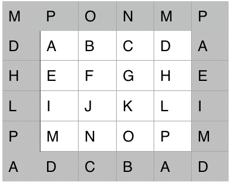
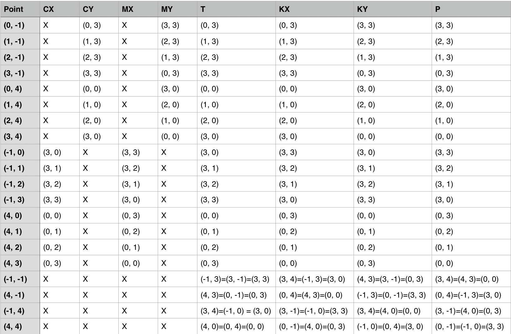

# Toggle

**Current status**: Development in progress.

**Toggle** is a Boggle-like variant (the name is a play on **Topological Boggle**) that was inspired
by the fact that on a regular Boggle board, the dice on the edges of the board (and in particular
in the corners of the board) are less "playable," since they have fewer neighbours than the
central dice.

I have always wanted to play Boggle on the surface of a torus to treat the outer tiles in the
same way as the inner tiles, and hence, the project idea was born. Given that a torus can be modeled
as the quotient space a unit square (into which I can embed a board), I figured: why stop there when
there are so many other surfaces that can be made from the quotient space of a unit square
where the opposite edges are related (or "glued together," like with a Mobius strip) in various ways?

And hence Toggle came to be.

1. The board can be:
    1. Embeddable in the plane, as per usual Boggle;
    2. Embeddable on a horizontal or vertical cylinder;
    3. Embeddable on a torus;
    4. Embeddable on a Mobius strip;
    5. Embeddable on a Klein bottle; or
    6. Embeddable on a projective plane.

2. The game can be timed or untimed.

3. I plan on ranking game boards (i.e. assigning them a unique number) so that players can play
simultaneously - or with the same board and rules at different times - without requiring any kind of connection.

This is also intended to be a personal exercise in playing with tries, trie-packing, learning JavaFX, and playing more
with Java 9 and 10.

I would additionally like to use this as an opportunity to investigate information compression and value by using tries
and packed tries to evaluate the inherent value in glyphs and words in different languages.

Other projects and ideas will probably emerge as the project continues.

Here is an image of a board embedded on the surface of a Klein bottle. The white squares indicate the dice, and the grey
squares indicate their adjacencies that are non-obvious.

Here are the calculations worked out for the non-obvious adjacencies of a 4x4 Boggle board with valid positions indexed
`(i, j)` for `0 <= i, j < 4`, where the columns mean:  
* The grid board is omitted, since this is evident.
* `CX` is the horizontal cylinder board.
* `CY` is the vertical cylinder board.
* `MX` is the horizontal mobius strip board.
* `MY` is the vertical mobius strip board.
* `KX` is the horizontal Klein bottle board (note `KX = CY + MX`).
* `KY` is the vertical Klein bottle board (note `KY = CX + MY`).
* `P` is the projective plane board (note `P = MX + MY`).

# Updates

## 2018-11-02
Currently, the project has:
 * Tries, trie-packing, and statistical comparisons between them.
 * Board geometries as described above.
